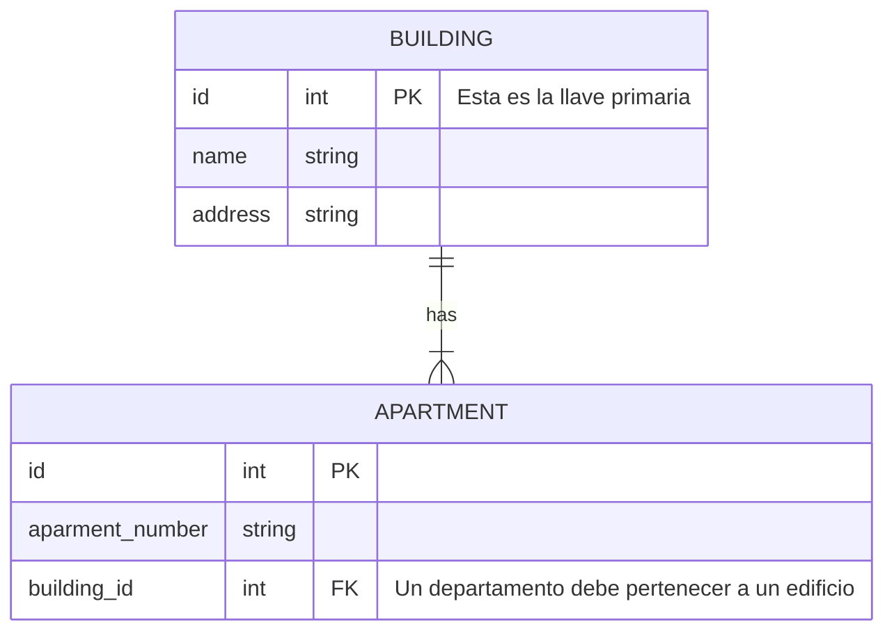

```mermaid
erDiagram 
BUILDING {
    id int PK "Esta es la llave primaria"
    name string
    address string
}

APARTMENT {
    id int PK
    aparment_number string
    building_id int FK "Un departamento debe pertenecer a un edificio" 
}

BUILDING ||--|{ APARTMENT :has
```
